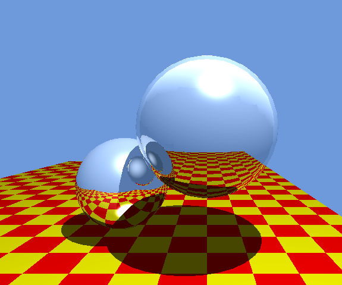
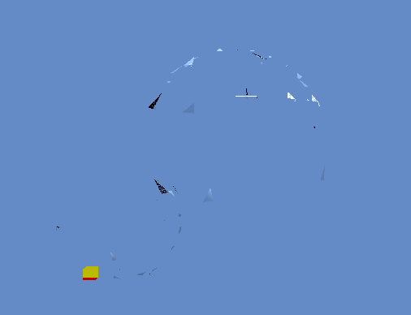
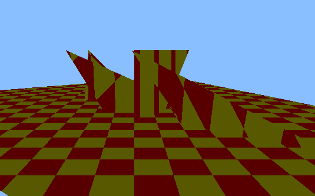
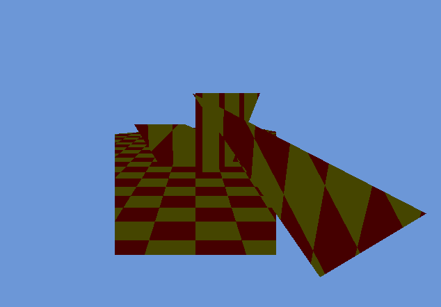

# Spatial Data Structures

Scene1 without BVH

Scene1 with BVH

Scene2 without BVH

Scene2 with BVH

I created Scene2 to help me figure out how the BVH Tree was failing, but I did not have enough time to debug it properly.

However, I am certain that my code is very close to working with either some small issue in the BVH Tree Traversal or BVH Tree building steps, and traversal on the GPU was certainly non-trivial and I have a very nearly working solution.