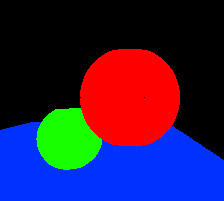
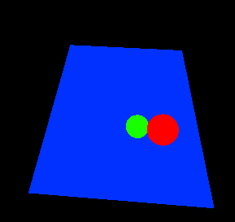
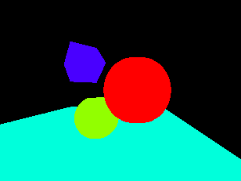

# Settings the scene

This image was rendered in RenderSharp.

# Extra Camera Angles

The camera has been moved up to get a top-down view on the scene and the field of view has been shrunk from 75° to 50°.

# Extra Objects

A cube has been added to the scene. It is rotated 45° along the x and y axes.

Adam Dernis
