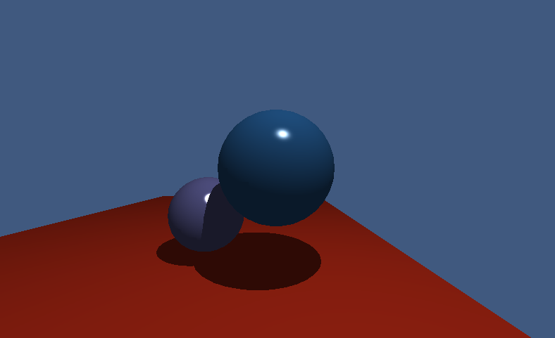
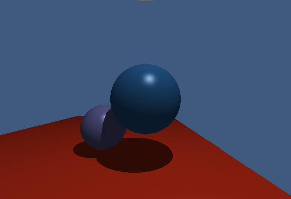
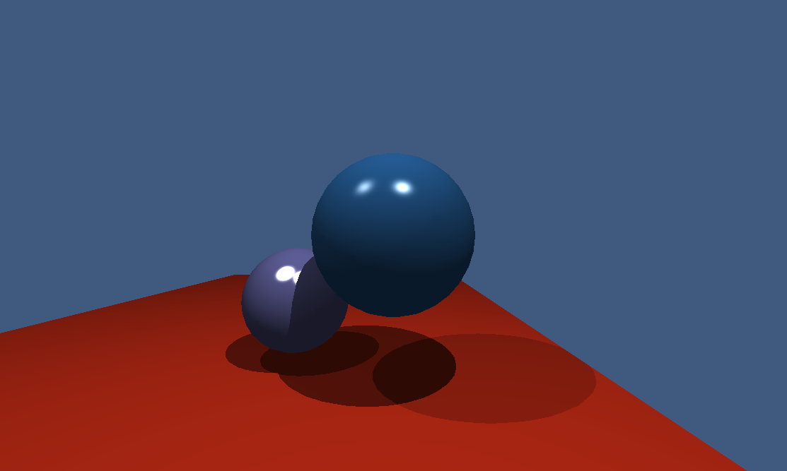

# Basic Shading

This image was rendered in RenderSharp.

# Phong Blinn

The materials shader has been swapped from Phong to Phong-Blinn

# Multiple Lights

An additional light source has been added to the scene

Adam Dernis
