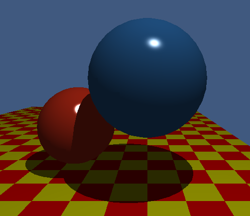
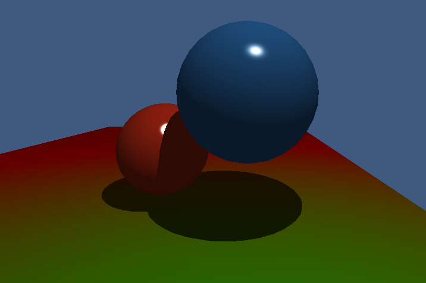
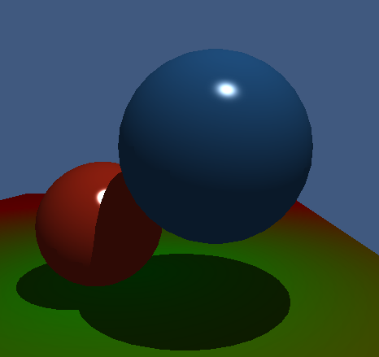
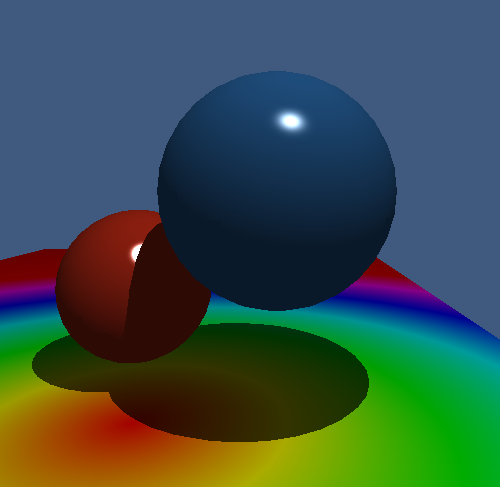
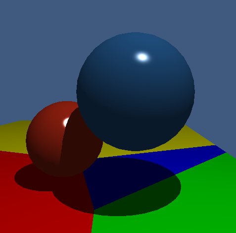

# Procedural Shading



This image was rendered in RenderSharp.

# Radial Gradient



A radial gradient texture has replaced the checkers

# Object Space



The texture space has been transformed to the object space instead of the world space

# HSV Radial Gradient Texture



The UnitY to UnitX colors have been replaced with an HSV wheel following the following function

```cs
float hf = hsv.X / 60;
int i = (int)MathF.Floor(hf);
float f = hf - i;
float pv = hsv.Z * (1 - hsv.Y);
float qv = hsv.Z * (1 - hsv.Y * f);
float tv = hsv.Z * (1 - hsv.Y * (1 - f));

return i switch
{
    0 => new float3(hsv.Z, tv, pv);
    1 => new float3(qv, hsv.Z, pv);
    2 => new float3(pv, hsv.Z, tv);
    3 => new float3(pv, qv, hsv.Z);
    4 => new float3(tv, pv, hsv.Z);
    5 => new float3(hsv.Z, pv, qv);
    6 => new float3(hsv.Z, tv, pv);
    _ => new float3(hsv.Z, pv, qv);
}
```


# Voronoi Texture



This texture uses 4 hardcoded points for the voronoi cells, but an algorithm could be developed to generate the points and iterate over a buffer

Adam Dernis
