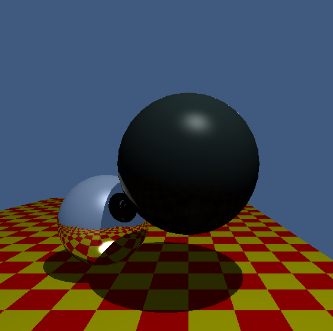

# Reflection

This image was rendered in RenderSharp. 

The spheres are both using a modifyied phong shader that adds a simple reflective component. The plane is just a standard phong shader.

Adam Dernis
