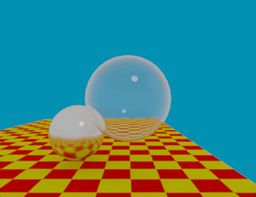
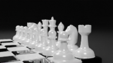
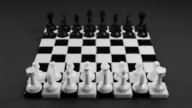
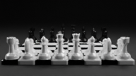
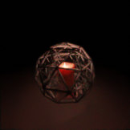
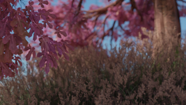

# RenderSharp

Made by Adam Dernis for Global Illuminations at RIT (CSCI-711)

[Project Link](https://github.com/Avid29/RenderSharp)

## Project Objectives

### Basic Objectives

##### I would consider these the bare minimum to have completed the project

- RenderSharp will be a rendering library written entirely in C# using the library [ComputeSharp](https://github.com/Sergio0694/ComputeSharp) to construct and run compute shaders

- Compute shaders will be used to run path tracing and material shading on the GPU

- Models can be programmatically entered and shaders explcitly written in C#

- Support for all components required by the standard ray tracer project
  
- Reasonably well recreate the scene below
  - Diffusion
  - Reflection
  - Transmission

    

    [Classic Ray Tracing Image Blender File](../Assignment1/SettingTheScene.blend)

### Additional Objectives

##### If possible I would like to do these

- BVH tree construction

- Linearly interpolated object transformation between key frames

- Models can be imported from one or more standard format, such as WaveFront OBJ, and material shading parameters can be imported from one or more standard format, such as WaveFront MTL.

- Reasonably well recreate the scenes below
  - Object instancing
  - Smooth Shading

    
    
    

    [High Resolution Alterate Image](https://www.artstation.com/artwork/r912AL)

    [Chess Set Blender File](ChessSet.blend)

### Semi-Unrealsitic Objectives

##### If I have heaps of extra time I'll give these a try

- I would like to use RenderSharp to render a playable 3D chess game

- Reasonably well recreate the scene below
  - Subsurface scattering
  - Lens Distrortion

    

    [High Resolution Alterate Image](https://www.artstation.com/artwork/xzawP4)

    [Candle Blender File](Candle.blend)

### Ridiculously Unrealistic Objectives

##### With a hope and a prayer?

- I would like to be able to generate material shaders using a node setup

- Reasonably well recreate the scene below
  - Elaborate Hair Particle System
  - Depth of field
  - Stability through very elaborate scene

    

    [High Resolution Image](https://www.artstation.com/artwork/ybaBx8)

    [Cherry Tree Blender File](Candle.blend)

## Software

- This project will be written in C# with [ComputeSharp](https://github.com/Sergio0694/ComputeSharp), a library which compiles C# code into HLSL compute shaders, then runs them on the GPU with DirectX12.

## Project Components

- Wrapping Infrastructure
  - Scenes can be built with a more simple object/mesh structure before being deployed to the GPU for rendering.

  - Render Manager
    - Realtime renderer that renderer frames directly to the display buffer.
    - Non-realtime renderer that renderers frames to a buffer and copies progress to the display buffer while rendering
      - Renders in segments
      - Supports cancellation*
      - Can save result to jpeg image file*

  - Renderer Interface
    - Allow a ray tracing renderer
    - Allow a wireframe renderer.*
    - Allow the use of a rasterization renderer*
      - Used for 3D chess game if needed

- Ray Tracer
  - Camera Ray Caster
    - Emit rays from camera with perspective
    - Runs on GPU
  - Geometry Collision Detection
    - Determine nearest geometry collision in path
    - Track collided geometry material
    - Calculate barycentric collision position
    - Runs on GPU
    - Speed up with spatial data structure*
  - Material Shaders
    - Implement shading model(s)
      - Diffusion
      - Reflection
      - Transmission
      - Emission*
      - Subsurface Scattering*
    - Run on GPU
  - Object Loader
    - Converts objects from common scene infrasture to renderable objects.
    - Builds a BVH tree with the loaded objects*
    - GPU Assisted*
  - Mesh Transformer*
    - Updates transformations on all vertices belonging to an object.
    - Update BVH trees instead of entirely constructing.*
    - GPU Assisted*
  - Sobol Pattern Generation*
    - Some form of randomization pattern will be needed for sampling, and sobol seems desirable, however if I find a better method or don't have time and find an easier method that maybe use that instead

###### *  Marked components are not a priority and may not be completed

## Timeline

The project should be minimally complete by simplying implementing the standard ray tracer project requirments with GPU support as the assignments come in.

I am more concerned about spending too much time on this project too little. I plan on adding at least one additional component on top of the ray tracing project requriments every other week.

My expected order is

- WaveFront import
- Object Instancing
- BVH Trees
- Smooth Shading
- Depth of Field
- Transformation Updates
- BVH Tree Updating
- Transformation Linear Interpolation
- tbd

## Final Presentation

There will be many challenges in parallelizing. These issues and their solutions will be a large part of my presentation.

## High Resolution Image Renderings Embedded

### Chess Set

### Candle

### Cherry Tree

